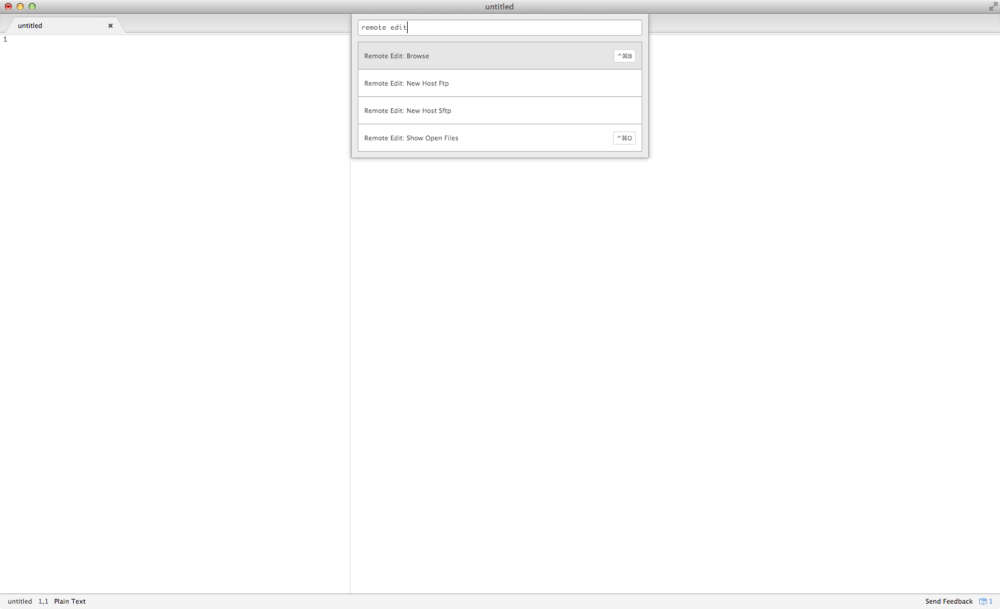
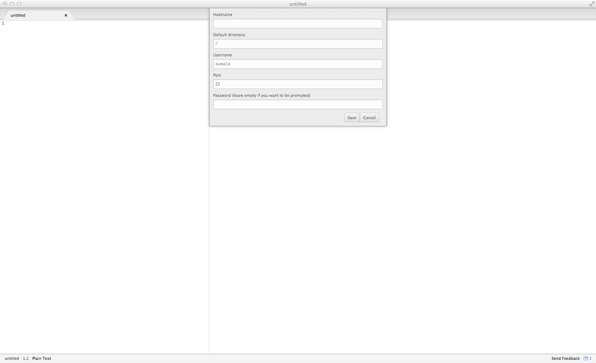
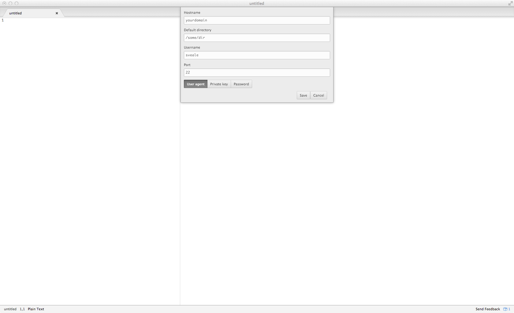
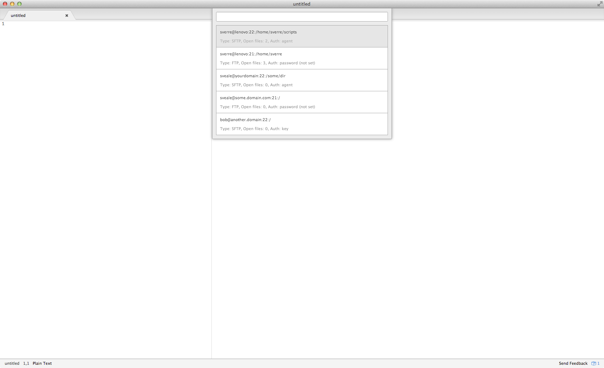
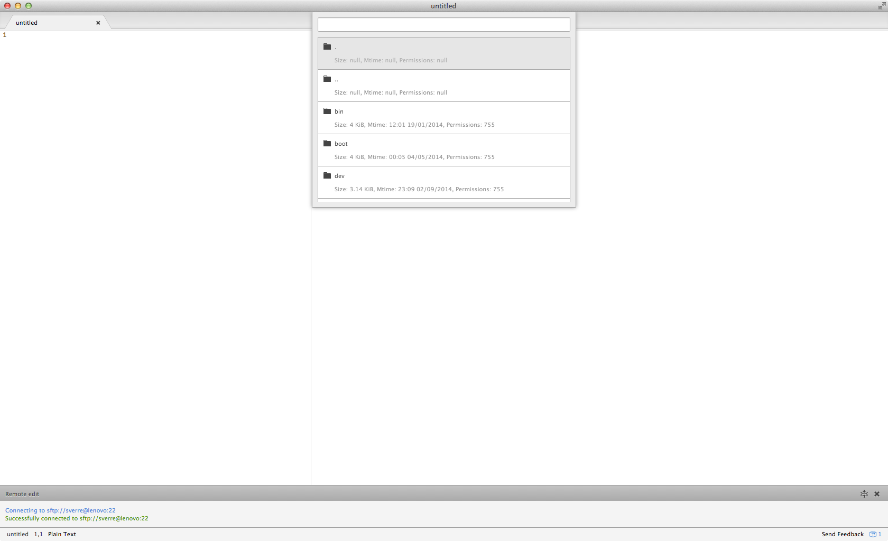
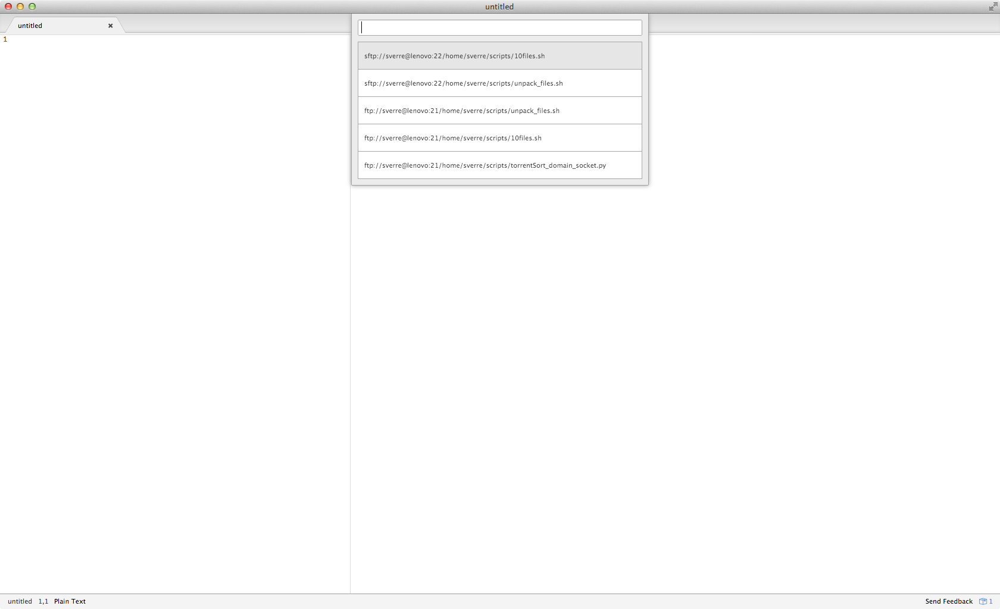
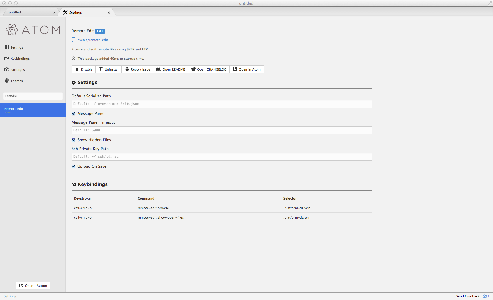

# remote-edit for atom.io

Atom package to browse and edit remote files using FTP and SFTP.

## Key features
* Add FTP/SFTP hosts graphically (FTPS not supported at the moment)
* Supports password, key and agent authentication
* Browse files through a select list
* Automatically upload file on save
* Multi-window support

## Keyboard shortcuts
### Windows / Linux
**ctrl-shift-b**: Select host

**ctrl-shift-o**: Show downloaded files

#### Mac OS X
**ctrl-cmd-b**: Select host

**ctrl-cmd-o**: Show downloaded files

#### Universal
While in "select host" mode you can delete a host by pressing "shift-d" or edit a host by pressing "shift-e".

While in "show downloaded files" mode you can remove a file from the list by pressing "shift-d". The file is deleted locally but not remotely.

## images
### Available commands

### Add a new FTP host

### Add a new SFTP host

### Edit existing host

### Select host

### Browse host

### Show downloaded files

## Settings window

